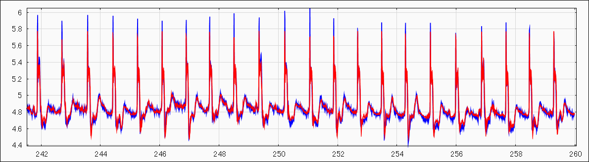
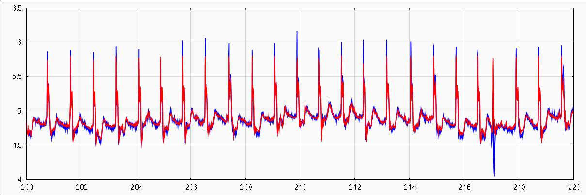
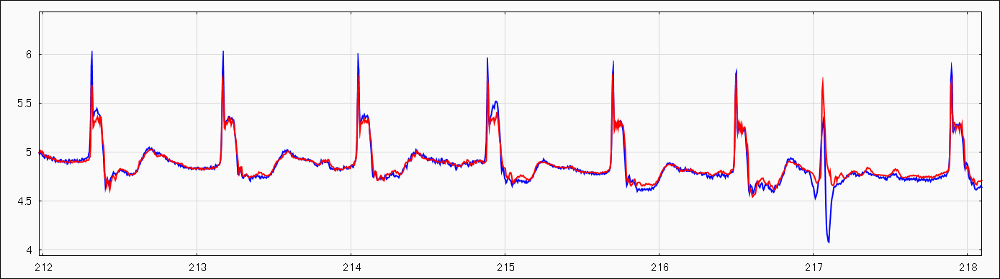
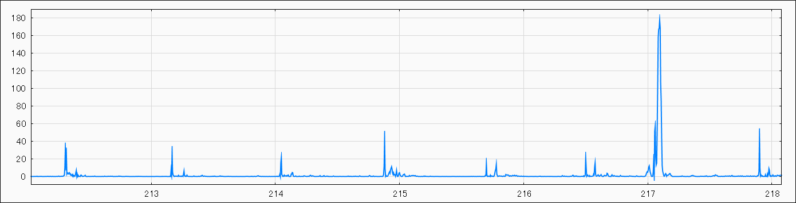

# Abnormality detection of time series data
This case is a reproduction of the following site.
[https://www.renom.jp/ja/notebooks/tutorial/time_series/lstm-anomalydetection/notebook.html](https://www.renom.jp/ja/notebooks/tutorial/time_series/lstm-anomalydetection/notebook.html)

Use ECG data qtdb / sel102 ECG dataset .
The data set can be obtained from the following URL.
[http://www.cs.ucr.edu/~eamonn/discords/](http://www.cs.ucr.edu/~eamonn/discords/)

It is a training result of time series data.
 

It is a superposition of trained inference and validation data.
 
At around time 4250, it is clear that the anomaly has occurred because the periodicity has collapsed.

From the Mahalanobis distance of the error vector
Calculate the degree of anomaly (rareness)
 
 

[2]E. Keogh, J. Lin and A. Fu (2005). HOT SAX: Efficiently Finding the Most Unusual Time Series Subsequence. In The Fifth IEEE International Conference on Data Mining.